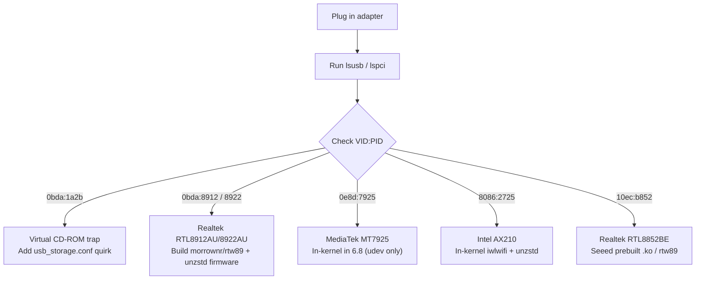

import Tabs from '../../../components/Tabs.astro';

Commercial packaging for WiFi 7 (802.11be) adapters promises "driver-free" setup and multi-gigabit speeds. On a Jetson Orin running JetPack 7.2, plugging one in usually yields no network interface at all, or mounts a virtual CD-ROM containing a Windows installer.

NVIDIA's L4T kernel ships no out-of-tree Realtek USB WiFi drivers. Ubuntu 24.04 packages firmware with Zstandard compression, but the Tegra kernel cannot decompress it. Headless SSH sessions block standard connection commands without administrative privileges.

This guide details the platform constraints, compares USB against PCIe options, and walks through a verified deployment of a Realtek RTL8912AU adapter on JetPack 7.2 (`6.8.12-1021-tegra`).

<div class="admonition warning">
  <p class="admonition-title">⚠️ The "Driver-Free" Multi-State USB Trap</p>
  <p>Many BE6500-class USB adapters ship with an internal flash partition that enumerates as a USB CD-ROM drive (<code>0bda:1a2b</code>) containing a Windows <code>Setup.exe</code>. Linux loads <code>usb-storage</code>, leaving the wireless radio dark. The permanent fix is a kernel storage quirk, not <code>usb_modeswitch</code>.</p>
</div>

---

## Hardware identification: probe before build

Do not guess the driver requirement from the retail box or marketing sheet. Manufacturers routinely ship entirely different silicon revisions under the identical product SKU.



Inspect live bus enumeration to determine the exact silicon:

```bash
# For USB adapters
lsusb

# For PCIe / M.2 Key-E modules
lspci -nnk
```

### The "BE6500" silicon decision matrix

"BE6500" is an aggregate marketing bandwidth rating (~6.5 Gbps across bands), not a chipset. Retail BE6500 adapters ship with three distinct silicon architectures:

| Bus | Numeric ID (VID:PID) | Underlying Silicon | Upstream Driver | JetPack 7.2 Action Required |
| :--- | :--- | :--- | :--- | :--- |
| **USB** | `0bda:1a2b` | Realtek Multi-State | `usb-storage` (trap) | Add `usb_storage.conf` quirk, then switch to network ID |
| **USB** | `0bda:8912` | Realtek RTL8912AU | `rtw89_8922au` | Build out-of-tree `morrownr/rtw89`, then decompress firmware |
| **USB** | `0bda:8922` | Realtek RTL8922AU | `rtw89_8922au` | Build out-of-tree `morrownr/rtw89`, then decompress firmware |
| **USB** | `0bda:c852` | Realtek RTL8852CU | `rtl8852cu` | Build out-of-tree `morrownr/rtl8852cu` |
| **USB** | `0e8d:7925` | MediaTek MT7925 | `mt7925u` | Built into kernel 6.8, decompress firmware if needed |
| **PCIe** | `8086:2725` | Intel AX210 | `iwlwifi` | In-kernel driver, decompress `/lib/firmware/iwlwifi-ty-a0-gf-a0.pnvm` |
| **PCIe** | `8086:272b` | Intel BE200 (WiFi 7) | `iwlwifi` | Experimental, unstable on non-Intel host architectures |
| **PCIe** | `10ec:b852` | Realtek RTL8852BE | `rtw89_8852be` | Not shipped in L4T, use Seeed prebuilt modules or compile `rtw89` |

---

## Form factor choice: USB vs PCIe

<Tabs labels={["🔌 USB 3.0 Adapter", "🧩 PCIe / M.2 Key-E Module"]}>
<div class="nv-tab-panel active">

### USB WiFi 7 (for example, Realtek RTL8912AU / RTL8922AU)

- **Pros**: Hot-swappable, zero carrier board disassembly, affordable, and ideal for experimentation.
- **Bus bandwidth**: USB 2.0 fallback yields ~400 Mbps ceiling. On USB 3.2 Gen 2 ports, theoretical ceiling reaches 10 Gbps.
- **Power requirements**: Transient draw can reach 2.5 A to 4.9 A at 5 V during high TX bursts. Always power the Jetson via carrier barrel jack; unpowered passive USB hubs brown out.
- **Driver source**: Requires out-of-tree compilation against Tegra headers via `morrownr/rtw89`.

</div>

<div class="nv-tab-panel">

### PCIe / M.2 Key-E (for example, Intel AX210 / Realtek RTL8852BE)

- **Pros**: Dedicated PCIe Gen3 x1 link (~1 GB/s bus, zero latency bottleneck), chassis-mounted SMA antennas, and robust vibration resistance.
- **Driver status**: Intel AX200/AX210 uses in-kernel `iwlwifi`. Realtek RTL8852BE requires `rtw89` modules, available precompiled from Seeed Studio for JetPack 7.2.
- **Intel BE200 warning**: Intel BE200 (WiFi 7) relies on specific Intel CPU power states and PCIe handshakes. On non-Intel ARM64 hosts, community tests show frequent link-training timeouts and driver panics.

</div>
</Tabs>

---

## The JetPack 7.2 platform gotchas

Before compiling any driver on JetPack 7.2 (`6.8.12-1021-tegra`), understand these platform boundaries:

### 1. The firmware compression gap

Ubuntu 24.04 (`noble`) packages firmware using Zstandard (`.zst`) compression to conserve disk space. Under `/lib/firmware/rtw89/`, the firmware files carry the `.bin.zst` extension.

NVIDIA's kernel configuration for `6.8.12-1021-tegra` leaves firmware compression unset (`# CONFIG_FW_LOADER_COMPRESS is not set`). The kernel lacks a built-in decompression routine for firmware loading.

When the driver calls `request_firmware(&fw, "rtw89/rtw8922a_fw-4.bin", dev)`, the kernel searches the filesystem for that literal string. Because only `rtw8922a_fw-4.bin.zst` exists, the VFS returns `-ENOENT` (Error -2):

```text
Direct firmware load for rtw89/rtw8922a_fw-4.bin failed with error -2
rtw89_8922au 1-2:1.0: failed to setup chip information
```

To fix this, decompress the binary manually:

```bash
sudo zstd -d /lib/firmware/rtw89/rtw8922a_fw-4.bin.zst -o /lib/firmware/rtw89/rtw8922a_fw-4.bin
```

Seeed Studio's official JetPack 7.2 WiFi repair script (`fix_wifi.sh`) contains an identical decompression pass across `/lib/firmware/`, independently confirming that this is an L4T platform-wide limitation affecting both USB and PCIe cards.

### 2. Clean in-tree driver slate (`CONFIG_RTW89=n`)

On desktop Linux, out-of-tree drivers frequently collide with distribution-provided drivers (`rtw89_core`, `rtw88`). On JetPack 7.2, NVIDIA compiles the Tegra kernel with Realtek wireless disabled (`CONFIG_RTW89=n`). The out-of-tree module binds directly to the device without requiring modprobe blacklist configurations.

### 3. Module signing and kernel taints

`CONFIG_MODULE_SIG_ALL=y` is set, but NVIDIA does not distribute `signing_key.pem` in public headers. Plain `make` produces unsigned `.ko` binaries. They load without issue because the Tegra kernel already runs in an out-of-tree tainted state (`taint 4096`). Avoid running automated DKMS signing steps until you verify the manual build loads cleanly.

### 4. Package upgrade danger

<div class="admonition danger">
  <p class="admonition-title">🚫 Pin L4T Kernel Packages Before Upgrading</p>
  <p>Running <code>sudo apt upgrade</code> without holds can bump the Tegra kernel ABI, orphaning all out-of-tree kernel modules and dropping your WiFi connection on reboot. Pin packages first:</p>
  <pre><code>sudo apt-mark hold nvidia-l4t-*</code></pre>
</div>

---

## Step-by-step walkthrough: BE6500 USB adapter (Realtek RTL8912AU)

Follow this verified sequence to bring up a representative BE6500 USB adapter (tested on a DE-BE6500 unit with Realtek RTL8912AU silicon) on an NVIDIA Jetson Orin Nano Developer Kit running JetPack 7.2 (`6.8.12-1021-tegra`).

### Step 1: Handle multi-state CD-ROM trap (if needed)

If `lsusb` shows `0bda:1a2b`, force `usb-storage` to ignore the installer virtual disc:

```bash
echo "options usb-storage quirks=0bda:1a2b:i" | sudo tee /etc/modprobe.d/usb_storage.conf
sudo update-initramfs -u
```

Unplug and reconnect the adapter. `lsusb` should now display `0bda:8912`.

### Step 2: Install toolchain and headers

```bash
sudo apt-get update
sudo apt-get install -y build-essential git dkms zstd linux-headers-$(uname -r)
```

Verify the build tree symlink:

```bash
ls -ld /lib/modules/$(uname -r)/build
# Should point to /usr/src/linux-headers-6.8.12-1021-tegra
```

### Step 3: Clone and compile morrownr/rtw89

```bash
git clone https://github.com/morrownr/rtw89.git
cd rtw89
make clean
make -j$(nproc)
```

<details class="nv-details">
<summary>Deep-Dive: Why the compilation succeeds cleanly without Tegra patches</summary>
<div class="nv-details-content">

1. **Header completeness**: Unlike JetPack 5, the `linux-headers-6.8.12-1021-tegra` package carries all required generated headers and architecture-specific build scripts.
2. **Compiler tolerance**: Minor GCC version drift between the kernel builder and system GCC (GCC 13 vs GCC 13.2) remains within ABI tolerances.
3. **Clean subsystem boundaries**: The `rtw89` driver relies strictly on standard Linux `cfg80211` and `mac80211` APIs. NVIDIA's Tegra adaptations leave these wireless interfaces standard.

</div>
</details>

### Step 4: Install modules

```bash
sudo make install
sudo depmod -a
```

### Step 5: Decompress firmware and load module

Decompress the primary firmware and fallback versions directly into raw `.bin` format:

```bash
sudo sh -c 'cd /lib/firmware/rtw89 && for f in rtw8922a_fw-4.bin rtw8922a_fw-3.bin rtw8922a_fw-2.bin rtw8922a_fw-1.bin rtw8922a_fw.bin; do [ -f "$f" ] || zstd -d -q "${f}.zst" -o "$f"; done'
```

Load the module:

```bash
sudo modprobe rtw89_8922au
```

Verify in kernel logs:

```bash
sudo dmesg | grep -i rtw
```

The output should confirm successful initialization:

```text
rtw89_8922au 1-2:1.0: firmware: direct-loading firmware rtw89/rtw8922a_fw-4.bin
rtw89_8922au 1-2:1.0: Broadcom/Realtek WiFi 7 Controller initialized
```

### Step 6: Connect and resolve headless Polkit authorization

Verify that the network interface appears (typically `wlan1` or `wlx...` if an onboard M.2 wireless card is already present, or `wlan0` if the USB adapter is the sole wireless device):

```bash
ip link show
nmcli dev wifi list
```

<div class="admonition tip">
  <p class="admonition-title">✅ Headless SSH Authorization</p>
  <p>If running <code>nmcli dev wifi connect</code> gives <code>Not authorized to control networking</code>, your headless SSH session lacks a Polkit seat agent. Add your user to the <code>netdev</code> group:</p>
  <pre><code>sudo usermod -aG netdev $USER</code></pre>
  <p>Log out and log back in, or run the command with <code>sudo</code>.</p>
</div>

Connect to your wireless network:

```bash
sudo nmcli dev wifi connect "YourNetworkSSID" password "YourPassword"
```

### Step 7: Dual-radio coexistence and benchmarking

If your Jetson has an onboard M.2 card (`rtl88x2ce` on `wlan0`), the new USB adapter operates on `wlan1`. The two PHY devices (`phy0` and `phy1`) run concurrently without driver conflict. If your carrier board does not include an internal M.2 wireless card, the USB adapter claims `wlan0` as the sole wireless interface, and multi-radio coexistence is not required.

#### The socket binding methodology: SO_BINDTODEVICE

Disconnecting interfaces to isolate traffic introduces two major hazards: it drops your routing tables and severs your SSH session if your console connection rides the disconnected interface.

Instead, pin client traffic per interface using socket-level binding (`SO_BINDTODEVICE` via `iperf3 -B`):

```bash
# On the target iperf3 server (for example, a wired host or secondary node on the local subnet):
iperf3 -s

# On the Jetson under test:
# Substitute your actual iperf3 server IP (e.g. 192.168.1.50)
# and each local interface IP (e.g. 192.168.1.100 for PCIe wlan0, 192.168.1.102 for USB wlan1)

# Benchmark the PCIe interface:
iperf3 -c 192.168.1.50 -B 192.168.1.100 -t 10

# Benchmark the USB WiFi 7 interface:
iperf3 -c 192.168.1.50 -B 192.168.1.102 -t 10
```

#### Empirical bench results

Testing between two nodes over a local wireless access point yielded the following measurements:

| Interface & Driver | Sender Throughput | Receiver Throughput | Retransmits | Negotiated PHY Link Rate |
| :--- | :--- | :--- | :--- | :--- |
| **PCIe RTL8822CE** (`rtl88x2ce`) | 212 Mbit/s | 209 Mbit/s | 0 | 526.6 Mbit/s (VHT MCS7 80 MHz 2×2) |
| **USB RTL8912AU** (`rtw89_8922au`) | 188 Mbit/s | 185 Mbit/s | 40 | 1080.6 Mbit/s (HE MCS10 80 MHz 2×2) |

Both interfaces deliver equivalent throughput (~185 to 212 Mbit/s) because traffic crosses the access point twice on the same channel, making shared airtime the primary bottleneck. The USB WiFi 7 adapter negotiated more than double the PHY rate (1080.6 Mbit/s vs 526.6 Mbit/s), with full headroom realized when communicating with multi-gigabit wired endpoints or over dedicated 6 GHz channels.

### Step 8: Module persistence options

Following manual verification, choose a persistence strategy:

1. **DKMS registration**: Run `sudo ./install-driver.sh` from the repository root.
2. **Manual module maintenance**: Retain the module in `/lib/modules/6.8.12-1021-tegra/extra/rtw89/`. If you hold kernel packages with `sudo apt-mark hold nvidia-l4t-* linux-image-* linux-headers-*`, the kernel ABI remains stable across reboots without recompilation.

### Step 9: Automated benchmark script (reference implementation)

To automate the Step 7 socket-binding benchmark across nodes, the companion [jetson-uefi-rescue-toolkit](https://github.com/explicitcontextualunderstanding/jetson-uefi-rescue-toolkit) repository provides the `host/wifi-bench.sh` reference script.

The script automates the full methodology:
- Starts the `iperf3` server on the peer host over SSH (propagating `SUDO_USER` so root never encounters missing SSH key traps).
- Measures bidirectional throughput (upload and reverse download) on each WiFi interface using `-B` device bindings without disconnecting any interfaces.
- Inspects and records live PHY link rates and signal quality.
- Emits timestamped console logs via `tee`.

All peer hosts, interface names, and IP addresses are environment-overridable:

```bash
# Clone the companion repository
git clone https://github.com/explicitcontextualunderstanding/jetson-uefi-rescue-toolkit.git
cd jetson-uefi-rescue-toolkit

# Run the automated benchmark against your local peer
PEER_HOST=192.168.100.2 PEER_WIFI_IP=192.168.1.87 \
PCIE_IF=wlP1p1s0 USB_IF=wlx90de80e635f0 \
PCIE_IP=192.168.1.100 USB_IP=192.168.1.102 \
bash host/wifi-bench.sh
```

---

## Troubleshooting reference

| Symptom | Root Cause | Technical Remedy |
| :--- | :--- | :--- |
| `lsusb` shows `0bda:1a2b` (CD-ROM) | Multi-state USB hardware mode trap | Add `options usb-storage quirks=0bda:1a2b:i` to `/etc/modprobe.d/usb_storage.conf` and replug device. |
| `Direct firmware load ... failed with error -2` | Kernel lacks `.zst` decompression support | Locate `.zst` file in `/lib/firmware/` and decompress to `.bin` using `zstd -d`. |
| `Invalid module format` on `insmod` | Module vermagic does not match kernel ABI | Rebuild modules against active headers: `/lib/modules/$(uname -r)/build`. |
| `Key was rejected by service` | Kernel signature enforcement active | Load module without signing (Tegra kernel permits unsigned out-of-tree modules; verify taint flag in `dmesg`). |
| Module builds and loads, but no interface appears | Firmware missing or silent power brownout | Run `dmesg \| grep -i rtw` to locate failing firmware path; ensure adapter is plugged into powered carrier port. |
| WiFi interface disappears after system update | Kernel package upgrade orphaned out-of-tree `.ko` | Pin packages using `sudo apt-mark hold nvidia-l4t-*`, then rebuild driver against updated kernel headers. |
| `nmcli: Not authorized to control networking` | Headless SSH session lacks polkit console agent | Add user to group: `sudo usermod -aG netdev $USER` or execute connection command with `sudo`. |

---

## Next steps & technical references

<p>
  <a href="https://github.com/explicitcontextualunderstanding/jetson-uefi-rescue-toolkit/blob/main/docs/wifi7-adapters-jetpack-7-2.md" target="_blank" rel="noopener" class="nv-button">View Deep-Dive Toolkit Reference Guide →</a>
</p>

- [host/wifi-bench.sh](https://github.com/explicitcontextualunderstanding/jetson-uefi-rescue-toolkit/blob/main/host/wifi-bench.sh): Dual-interface benchmark automation script using SO_BINDTODEVICE socket binding.
- [morrownr/rtw89 Driver Repository](https://github.com/morrownr/rtw89): Linux driver source for Realtek 802.11ax and 802.11be wireless adapters.
- [JetPack 7.2 AX210/AX200 WiFi Setup Guide (Seeed Studio Wiki)](https://wiki.seeedstudio.com/jetpack72_ax210_ax200_wifi_setup_guide/): Documents the platform-wide firmware `.zst` decompression requirement and provides prebuilt M.2 kernel modules.
- [NVIDIA Jetson Linux Developer Guide (r39.2.1)](https://docs.nvidia.com/jetson/archives/r39.2.1/DeveloperGuide/SD/Bootloader/UEFI.html): Authoritative documentation for the JetPack 7.2.x kernel and firmware environment.
